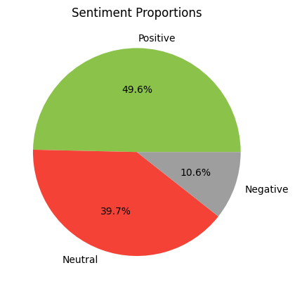

# 🧠 Social Media Sentiment Analysis

This project analyzes the sentiment of tweets on a given topic using Natural Language Processing (NLP) techniques.

## 📌 Highlights

- ✅ **Tweets Collected:** 500+ tweets using `snscrape`
- ✅ **Cleaning:** Removed hashtags, links, emojis, etc.
- ✅ **Sentiment Analysis:** Used **VADER** for classifying tweets into Positive, Neutral, or Negative
- ✅ **Visualizations:** Word Clouds, Pie Chart of sentiment distribution

---

## 📊 Sentiment Distribution

---

## 📁 Project Files

| File | Description |
|------|-------------|
| `Social_Media_Sentiment_Analysis.ipynb` | Main Jupyter/Colab notebook |
| `sentiment_results.csv` | Tweets with assigned sentiment labels |
| `sentiment_pie_chart.png` | Pie chart visual of sentiment distribution |
| `README.md` | Project overview |

---

## 🛠️ Tools Used

- `Python`  ·  `snscrape`  ·  `nltk`  ·  `vaderSentiment`  
- `pandas`, `matplotlib`, `seaborn`, `wordcloud`  
- Google Colab (for execution)

---

## 📈 Key Insight

> Positive sentiment dominates with ~50% of tweets, followed by Neutral (~40%) and a smaller portion of Negative tweets (~10%).

---

## 👤 Author

**Keerthi Reddy**  
_Data Analyst Enthusiast_  
🔗 GitHub: [KeerthiReddy117](https://github.com/KeerthiReddy117)

---

## 📝 License

This project is open source under the [MIT License](LICENSE).

