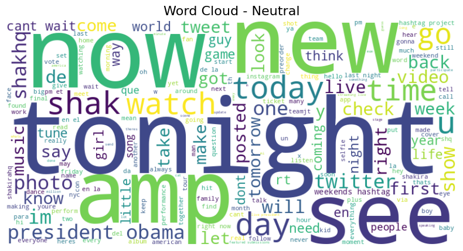

# Social Media Sentiment Analysis

This project analyzes the sentiment of tweets on a given topic using Natural Language Processing (NLP) techniques and the VADER sentiment analyzer.

## 📌 Highlights

- ✅ **Tweets Collected:** 500+ using `snscrape`
- ✅ **Cleaning:** Removed hashtags, links, emojis, etc.
- ✅ **Sentiment Analysis:** Classified tweets as Positive, Neutral, or Negative using VADER
- ✅ **Visualizations:**
  - Word clouds for each sentiment
  - Pie chart of sentiment distribution

## 📂 Files Included

| File | Description |
|------|-------------|
| `Social_Media_Sentiment_Analysis.ipynb` | Colab notebook with full code |
| `sentiment_results.csv` | Processed tweets with sentiment labels |
| `sentiment_pie_chart.png` | Sentiment distribution chart |
| `wordcloud_positive.png` | Word cloud of positive tweets |
| `wordcloud_neutral.png` | Word cloud of neutral tweets |
| `wordcloud_negative.png` | Word cloud of negative tweets |

## 📊 Sample Output

### Word Clouds

**Positive**  

**Neutral**  

**Negative**  

## 🔧 Tools & Libraries

- Python, Jupyter Notebook
- `snscrape`, `pandas`, `matplotlib`, `seaborn`, `wordcloud`, `nltk`, `vaderSentiment`

## 📈 How It Works

1. **Scrape tweets** using `snscrape`
2. **Preprocess tweets**: Remove special characters, links, and emojis
3. **Classify sentiment** using VADER
4. **Visualize** with word clouds and pie charts

---

🔗 **GitHub:** (https://github.com/KeerthiReddy117/social-media-sentiment-analysis-)

